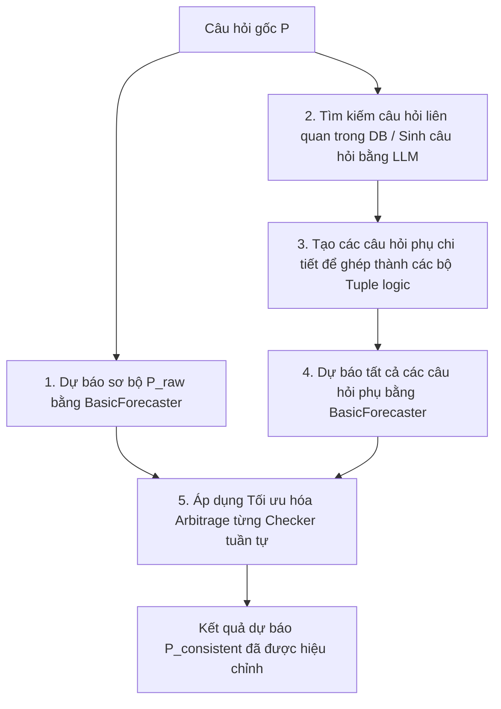

# SO SÁNH CHI TIẾT PIPELINE: PHƯƠNG PHÁP GỐC (ARBITRAGE) vs HYBRIDACD

Tài liệu này trình bày và phân tích chi tiết hai quy trình xử lý (pipeline) cốt lõi trong hệ thống đánh giá tính nhất quán logic của mô hình dự báo ngôn ngữ lớn: **Phương pháp gốc (Arbitrage/ConsistentForecaster)** của nhóm tác giả nghiên cứu ICLR 2025 và **Phương pháp tối ưu hóa HybridACD (Hybrid Adversarial Consistency Defense)**.

---

## 1. PHƯƠNG PHÁP GỐC: Arbitrage Forecaster (`ConsistentForecaster`)

### A. Ý tưởng cốt lõi
Phương pháp gốc của nhóm tác giả giải quyết bài toán: **Làm sao để đưa ra một dự báo nhất quán cho một câu hỏi đơn lẻ ($P$)**. 
Vì một câu hỏi đứng riêng lẻ không thể tự kiểm tra tính nhất quán logic (cần có các mệnh đề liên quan như phủ định $\neg P$, hệ quả $Q$ nếu $P \implies Q$, hoặc phép hội $P \land Q$), hệ thống phải tự động **sinh thêm các câu hỏi phụ và liên kết chúng thành các bộ kiểm tra (Question Tuples)**, sau đó áp dụng lý thuyết kinh tế học (Arbitrage) để tối ưu hóa xác suất.

### B. Sơ đồ Pipeline


### C. Các bước thực thi chi tiết trong Code
Quy trình được cài đặt tại [consistent_forecaster.py](file:///d:/UIT%20Document/UIT%20subjects/DS391%20-%20LLM/Project/consistency-forecasting/src/forecasters/consistent_forecaster.py):

1. **Dự báo sơ bộ (Elicit initial forecast)**:
   * Hệ thống gọi `self.hypocrite.call(sentence)` (sử dụng `BasicForecaster`) để lấy xác suất ban đầu $P(P)_{raw}$.
2. **Tìm kiếm & Tạo câu hỏi liên quan (Retrieve & Generate related questions)**:
   * Chạy hàm `bq_function` để tìm các câu hỏi tương quan cấu trúc hoặc dùng LLM viết các câu hỏi liên đới.
3. **Khởi tạo bộ Tuple logic (Instantiate Tuples)**:
   * Chạy hàm `instantiate_cons_tuples` để xây dựng đầy đủ các biến mệnh đề cho các Checker được định nghĩa trước (ví dụ: tạo mệnh đề phủ định $\neg P$ cho NegChecker, tạo mệnh đề hội/tuyển cho AndOrChecker).
4. **Dự báo các mệnh đề phụ (Elicit auxiliary forecasts)**:
   * Gọi mô hình dự báo cơ bản (`BasicForecaster`) chạy trên toàn bộ các câu hỏi phụ vừa sinh ra để thu thập xác suất dự báo thô của chúng.
5. **Tối ưu hóa Arbitrage tuần tự (Sequential Arbitrage Optimization)**:
   * Duyệt qua từng Checker đã cấu hình (Negation, Paraphrase, AndOr, But, Conditional...):
     * Gửi toàn bộ các xác suất thu được vào hàm `check.max_min_arbitrage()`.
     * Hàm này giải bài toán tối ưu hóa toán học để tìm ra bộ xác suất mới gần nhất với dự báo ban đầu nhưng tuân thủ tuyệt đối các ràng buộc toán học của Checker đó.
     * Cập nhật xác suất $P(P)$ sau mỗi bước với trọng số tăng dần (để giữ cho kết quả của câu hỏi đích không bị lệch quá xa khi duyệt qua nhiều Checker khác nhau).

### D. Ưu điểm & Nhược điểm
* **Ưu điểm**: Đảm bảo đầu ra của câu hỏi đích nhất quán với một loạt các mối quan hệ logic xung quanh nó, ngay cả khi người dùng chỉ cung cấp đúng một câu hỏi đầu vào duy nhất.
* **Nhược điểm**: 
  * **Chi phí cực kỳ đắt đỏ**: Một câu hỏi đơn lẻ yêu cầu sinh thêm hàng chục câu hỏi phụ và thực hiện hàng chục cuộc gọi LLM API độc lập. Chi phí ước tính lên đến ~$2,500 USD cho một tập dữ liệu thử nghiệm nhỏ.
  * **Thời gian phản hồi chậm**: Do phải xử lý đệ quy và nhiều bước LLM nối tiếp.

---

## 2. PHƯƠNG PHÁP TỐI ƯU HÓA: HybridACD (`HybridACDForecaster`)

### A. Ý tưởng cốt lõi
Phương pháp **HybridACD** được thiết kế cho các kịch bản đánh giá/benchmark trong đó hệ thống **đã có sẵn các bộ câu hỏi Tuple** cần kiểm tra. Thay vì sinh câu hỏi phụ và chạy tối ưu hóa hậu kỳ đắt đỏ, HybridACD thực hiện:
1. **Input-side**: Phòng thủ đối kháng và kích hoạt Chain-of-Thought để tăng khả năng suy luận logic của mô hình.
2. **Output-side**: Ràng buộc không gian giải mã xác suất (Token Constraint Decoding - TCD) dựa trên các ràng buộc toán học của Checker và các câu hỏi đã dự báo trước đó trong cùng một Tuple.

   ### B. Sơ đồ Pipeline
   ```mermaid
   graph TD
      A[Nhận bộ Tuple logic gồm các câu hỏi P, Q, P_and_Q...] --> B[Duyệt tuần tự từng câu hỏi trong Tuple]
      B --> C[1. Viết lại câu hỏi bằng Adversarial Input Agent]
      C --> D[2. Tính toán khoảng xác suất hợp lệ logic [lower, upper] dựa trên lịch sử dự báo]
      D --> E[3. Dự báo kèm Chain-of-Thought suy luận sâu]
      E --> F[4. Áp dụng Logit Bias -100 loại bỏ các token xác suất nằm ngoài khoảng hợp lệ]
      F --> G[5. Trích xuất xác suất bằng Parsing Model + Clip fallback]
      G --> H[Lưu xác suất vào lịch sử dự báo của Tuple & chuyển sang câu hỏi kế tiếp]
   ```

### C. Các bước thực thi chi tiết trong Code
Quy trình được cài đặt tại [hybrid_acd_forecaster.py](file:///d:/UIT%20Document/UIT%20subjects/DS391%20-%20LLM/Project/consistency-forecasting/src/forecasters/hybrid_acd_forecaster.py):

1. **Vòng lặp Tuple tuần tự**:
   * Chạy qua danh sách câu hỏi trong Tuple: `for key in keys: fq = fqs[key]`.
2. **Đối kháng đầu vào (Adversarial Rewrite)**:
   * Nếu `adversarial_enabled = True`, gọi `adversarial_rewrite_sync` gửi câu hỏi đến một LLM phụ (ví dụ: `Llama-3-70B`).
   * Viết lại tiêu đề và nội dung câu hỏi một cách phức tạp và đánh đố về mặt từ vựng nhưng giữ nguyên logic toán học để kiểm tra xem mô hình có bị bẫy bởi cấu trúc ngữ pháp hay không.
3. **Tính toán biên nhất quán (Consistency Bounds Calculation)**:
   * Chạy hàm `get_consistency_bounds`. Dựa vào tập hợp các câu hỏi trong Tuple (nhận diện Checker) và các giá trị xác suất đã được dự đoán ở các bước trước (`previous_predictions`), tự động tính toán khoảng toán học hợp lệ `[lower_bound, upper_bound]`.
     * *Ví dụ (NegChecker)*: Tuple gồm `P` và `not_P`. Nếu `not_P` đã chạy trước và ra kết quả `0.3`, thì khoảng biên của `P` sẽ được ép chặt về đúng `[0.7, 0.7]`.
4. **Suy luận Chain-of-Thought (CoT)**:
   * Gửi câu hỏi đã viết lại đến mô hình Forecaster chính với chỉ thị suy luận từng bước. Câu trả lời của mô hình sẽ chứa phần lập luận tự do (scratchpad) rồi mới đưa ra dự báo.
5. **Ràng buộc giải mã token (Token Constraint Decoding - TCD)**:
   * Sử dụng thư viện `tiktoken` để dịch các số xác suất không hợp lệ (nằm ngoài khoảng `[lower_bound, upper_bound]`) thành token ID.
   * Gán giá trị điểm phạt `logit_bias = -100` cho các token không hợp lệ này.
   * Gọi mô hình parser (`gpt-4o-mini-2024-07-18`) đọc đoạn CoT của Forecaster chính để trích xuất số xác suất, buộc mô hình parser chỉ được chọn các token số nằm trong khoảng an toàn.
6. **Chốt chặn Softmax Fallback**:
   * Nếu quá trình gán logit bias hoặc gọi parser bị lỗi, hệ thống sẽ dùng Regex để trích xuất số và dùng hàm `np.clip(prob_val, lower_bound, upper_bound)` để cắt giá trị về đúng khoảng hợp lệ toán học trước khi lưu lại.

### D. Ưu điểm & Nhược điểm
* **Ưu điểm**:
  * **Chi phí cực thấp**: Không cần sinh thêm câu hỏi phụ đệ quy, số lượng LLM call tối giản (chỉ gồm 1 cuộc gọi đối kháng nếu cần, 1 cuộc gọi CoT và 1 cuộc gọi parse logits).
  * **Độ nhất quán tuyệt đối (100%)**: Nhờ can thiệp trực tiếp vào logits giải mã và chốt chặn `np.clip` toán học.
  * **Độ chính xác thực nghiệm cao**: Cơ chế CoT giúp mô hình lập luận sâu sắc hơn.
* **Nhược điểm**:
  * Yêu cầu các câu hỏi phải được xử lý tuần tự trong cùng một Tuple (không thể chạy song song hoàn toàn mọi câu hỏi trong một Tuple vì câu hỏi sau phụ thuộc vào kết quả của câu hỏi trước).

---

## 3. BẢNG SO SÁNH TỔNG HỢP

| Tiêu chí so sánh | Phương pháp gốc (Arbitrage) | Phương pháp tối ưu HybridACD |
| :--- | :--- | :--- |
| **Lớp cài đặt trong Code** | [ConsistentForecaster](file:///d:/UIT%20Document/UIT%20subjects/DS391%20-%20LLM/Project/consistency-forecasting/src/forecasters/consistent_forecaster.py#L22) | [HybridACDForecaster](file:///d:/UIT%20Document/UIT%20subjects/DS391%20-%20LLM/Project/consistency-forecasting/src/forecasters/hybrid_acd_forecaster.py#L36) |
| **Dữ liệu đầu vào yêu cầu** | Một câu hỏi đơn lẻ $P$ | Một bộ câu hỏi Tuple hoàn chỉnh (ví dụ: $P$, $\neg P$) |
| **Cách đạt được sự nhất quán** | Tối ưu hóa toán học hậu kỳ (Post-hoc optimization) sau khi thu thập tất cả xác suất của cả bộ Tuple | Ép biên giải mã thời gian thực (Decoding-time constraint) dựa trên lịch sử dự báo của Tuple |
| **Chi phí LLM API** | Rất cao (yêu cầu tạo và dự báo đệ quy thêm nhiều câu hỏi phụ) | Rất thấp (chỉ thực hiện CoT trực tiếp và 1 bước parse logits) |
| **Khả năng suy luận** | Dựa trên phản xạ trực tiếp của mô hình gốc (BasicForecaster) | Được tăng cường bằng CoT và phòng thủ đối kháng đầu vào |
| **Mức độ nhất quán đạt được** | Gần như nhất quán hoàn toàn (phụ thuộc sai số hội tụ tối ưu) | Nhất quán tuyệt đối 100% (nhờ cơ chế logit bias và clipping bắt buộc) |
